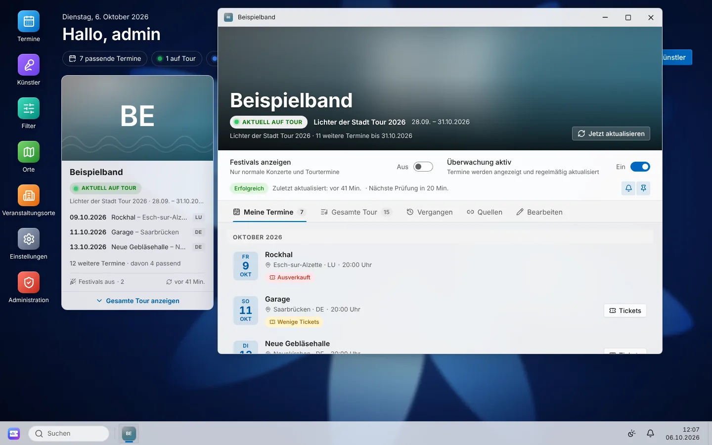
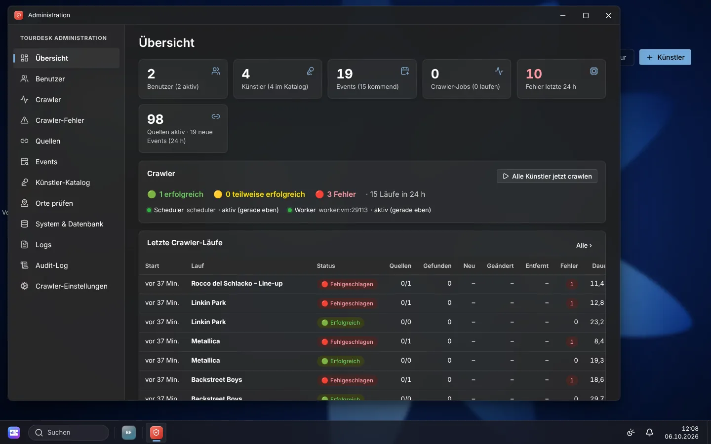
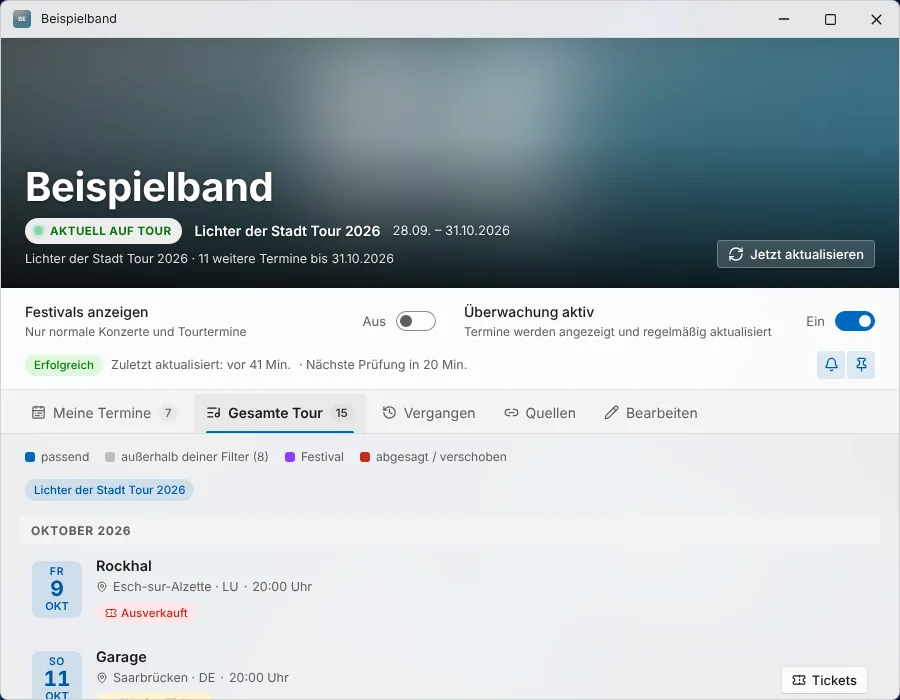
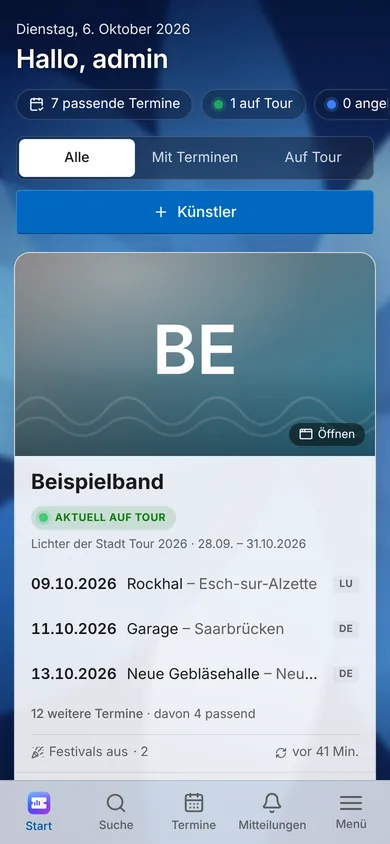
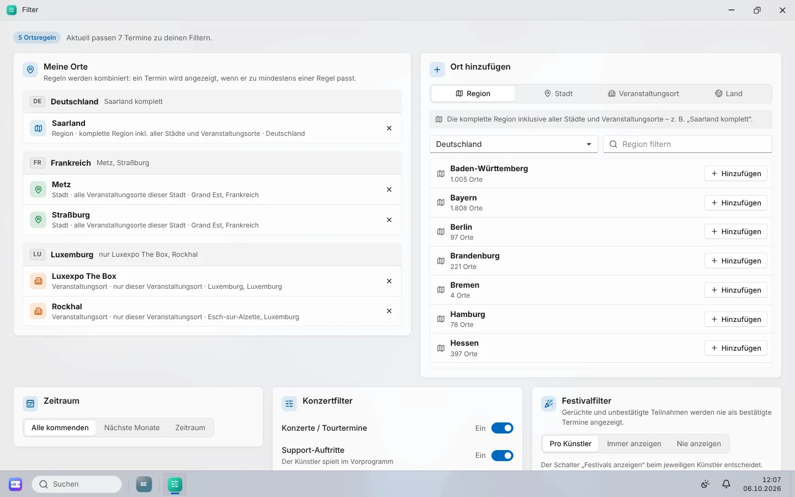

# TourDesk

**Persönliche Konzert- und Tourüberwachung im Stil eines Windows‑11‑Desktops.**
TourDesk überwacht die Künstler und Bands seiner Benutzer, durchsucht ungefähr stündlich
offizielle Websites, Tourseiten, Veranstaltungsorte, Festivals und Ticketanbieter und zeigt
jedem Benutzer nur die Termine, die zu *seinen* Regionen, Städten und Veranstaltungsorten
passen – die komplette Tour bleibt trotzdem mit einem Klick sichtbar.

TourDesk läuft vollständig selbst gehostet (z. B. in einem eigenen Proxmox‑LXC), ist im LAN
sofort nutzbar und für den späteren Zugriff über einen **Cloudflare Tunnel** vorbereitet.

> Kurzanleitung: **[QUICKSTART.md](QUICKSTART.md)** · Architektur: **[docs/ARCHITECTURE.md](docs/ARCHITECTURE.md)** ·
> Crawler-Provider: **[docs/PROVIDERS.md](docs/PROVIDERS.md)**



---

## Inhalt

1. [Funktionen](#funktionen)
2. [Architektur](#architektur)
3. [Installation](#installation)
4. [Erste Inbetriebnahme](#erste-inbetriebnahme)
5. [Konfiguration](#konfiguration)
6. [Bedienung](#bedienung)
7. [Filterlogik](#filterlogik)
8. [Beispielkonfiguration](#beispielkonfiguration)
9. [Datenbank](#datenbank)
10. [Benutzerverwaltung](#benutzerverwaltung)
11. [Crawler](#crawler)
12. [Neue Crawler-Provider hinzufügen](#neue-crawler-provider-hinzufügen)
13. [Backup](#backup)
14. [Restore](#restore)
15. [Update](#update)
16. [Logs](#logs)
17. [Sicherheit](#sicherheit)
18. [Cloudflare Tunnel](#cloudflare-tunnel)
19. [Proxmox/LXC-Betrieb](#proxmoxlxc-betrieb)
20. [Fehlerbehebung](#fehlerbehebung)
21. [Entwicklung und Tests](#entwicklung-und-tests)
22. [Erweiterbarkeit](#erweiterbarkeit)
23. [Lizenzen und Datenquellen](#lizenzen-und-datenquellen)

---

## Funktionen

**Für Benutzer**

* **Künstler-Kacheln** auf dem Desktop: Künstlerbild, Name, Genre, Tourstatus
  (🟢 AKTUELL AUF TOUR · 🔵 TOUR ANGEKÜNDIGT · ⚪ DERZEIT NICHT AUF TOUR), passende Termine,
  Anzahl weiterer Termine, Festivalstatus und Zeitpunkt der letzten Aktualisierung.
* **Aufklappbare Gesamttour**: alle bekannten Tourtermine, Termine außerhalb der eigenen Filter
  dezent dargestellt, Festivals, Support-Auftritte, Absagen und Verschiebungen gekennzeichnet.
* **Künstlerfenster** (verschieben, minimieren, maximieren, schließen, mehrere gleichzeitig):
  großes Bild, Tourstatus, Festival-Schalter, passende Termine, gesamte Tour, Ticketlinks,
  Quellen, letzte Aktualisierung, Bearbeiten.
* **Termindetails** mit Datum, Uhrzeit/Einlass, Veranstaltungsort, Stadt, Region, Land, Tour,
  Festival ja/nein, Ticketstatus und -anbieter, **„Tickets kaufen“** (immer die echte externe
  Seite), Originalquelle(n), „3 Quellen bestätigen diesen Termin“, Kalenderexport (.ics) und
  **„Warum wird dieses Event (nicht) angezeigt?“**.
* **Hierarchische Filter**: Länder, Regionen/Bundesländer, Städte und einzelne
  Veranstaltungsorte, beliebig kombinierbar (z. B. *Saarland komplett*, in Luxemburg *nur
  Rockhal und Messegelände*, in Frankreich *nur Metz und Straßburg*).
* **Festival-Schalter pro Künstler** (ON/OFF), dazu globaler Festivalfilter, Zeitraum und
  Eventtypen. Gerüchte werden nie als bestätigte Termine angezeigt.
* **Windows‑11‑Oberfläche**: Desktop mit Hintergrund und Verknüpfungen, Taskleiste mit
  TourDesk‑Startbutton und Künstlerbildern, Startmenü, Schnelleinstellungen, globale Suche
  („Backstreet Boys“, „Rockhal“, „Saarland“), Benachrichtigungszentrale mit Kalender,
  Hell/Dunkel/System, Akzentfarben, Transparenz, Animationen, 12 lokale Hintergründe.
* **Mobil**: große Karten, Vollbild-Apps, untere Navigation, große Touchflächen – ohne
  Drag & Drop.
* **Benachrichtigungen** in der Oberfläche (neuer Termin, Termin in bevorzugter Region,
  Ticketverkauf gestartet, Termin geändert, Absage/Verschiebung, Festivalauftritt bestätigt);
  E-Mail, Push, Telegram, Discord und WhatsApp sind architektonisch vorbereitet.

**Für Administratoren**

* Dashboard mit Benutzern, Künstlern, Events, Crawler-Jobs, Fehlern der letzten 24 h,
  Crawlerstatus 🟢/🟡/🔴, letzten Läufen, Fehlern, problematischen Quellen, neuen Events und
  neuen Benutzern.
* Benutzerverwaltung: anlegen, bearbeiten, deaktivieren, löschen, Passwort zurücksetzen,
  Rollen ändern, Sperren aufheben, Künstler/Filter/Aktivität eines Benutzers einsehen,
  **„Ansicht als Benutzer öffnen“** (deutlich gekennzeichnet, nur lesend).
* Crawler: Worker-/Scheduler-Status, Warteschlange, Läufe mit Protokoll, Jobs, Domains,
  Fehler; einzelne Künstler oder Quellen erneut ausführen, **Quellen im Probelauf prüfen**.
* Alle Events mit Rohdaten der Quellen und Sichtbarkeitserklärung für jeden Benutzer.
* System- und Datenbankstatus, Log-Viewer, Audit-Log, zentrale Crawler-Einstellungen,
  Prüfung automatisch angelegter Orte.



## Architektur

```text
Browser ──HTTP──► TourDesk API (FastAPI, liefert auch das React-Frontend aus) ──► PostgreSQL
                                                                                  ▲     ▲
Scheduler (eigener Prozess) ──plant Jobs──► crawler_jobs ◄──holt Jobs── Worker ──┘     │
                                                                  │  (Provider, Normalizer,
                                                                  └─ Deduplicator, Store) ┘
```

* Web/API, Worker und Scheduler sind **getrennte Prozesse**, die nur über die Datenbank
  kommunizieren – ein langsamer oder fehlerhafter Crawler blockiert niemals die Website.
* Die Job-Warteschlange liegt in PostgreSQL (`FOR UPDATE SKIP LOCKED`) – kein Redis nötig.
* **Ein HTTP-Port** (Standard `8080`), auf den später der Cloudflare Tunnel zeigt.

| Bereich     | Technik |
|-------------|---------|
| Frontend    | React 19, TypeScript, Vite, TanStack Query, Zustand, eigenes Fluent-/Windows‑11-Designsystem |
| Backend/API | Python 3.11+, FastAPI, Pydantic v2, SQLAlchemy 2, Alembic |
| Crawler     | httpx (höflicher HTTP-Client), BeautifulSoup + lxml, JSON-LD/Microdata/iCal-Extraktion, rapidfuzz |
| Datenbank   | PostgreSQL 15/16 (`pg_trgm`) |
| Auth        | serverseitige Sessions (HttpOnly-Cookie), Argon2id, CSRF-Token |
| Betrieb     | systemd (nativ, Standard im LXC) oder Docker Compose |

```text
tourdesk/
├── frontend/      React-App (Desktop, Fenster, Apps, Adminbereich)
├── backend/       Python-Paket „tourdesk“: API, Modelle, Services, Sicherheit, CLI
├── crawler/       Python-Paket „tourdesk_crawler“: Provider, Pipeline, Worker, Scheduler
├── database/seed/ Geodaten (Länder, Regionen, Städte), Venues, Festivals
├── migrations/    Alembic-Migrationen
├── docker/        Dockerfile, Entrypoint
├── scripts/       backup.sh, restore.sh, update.sh, run-tests.sh, run-e2e.sh
├── tests/         pytest (Unit, API, Crawler) und tests/e2e (Playwright)
├── docs/          Architektur, Provider, Screenshots
├── install.sh     Installation
├── docker-compose.yml
└── .env.example
```

Details zu Datenmodell, API, Crawler und Sicherheit: **[docs/ARCHITECTURE.md](docs/ARCHITECTURE.md)**.

## Installation

### Voraussetzungen

* Debian 12/13 oder Ubuntu 24.04 (z. B. Proxmox‑LXC, siehe [Proxmox/LXC-Betrieb](#proxmoxlxc-betrieb))
* 2 vCPU, 2 GB RAM, 10 GB Speicher (für viele Künstler und Bilder gern mehr)
* Internetzugang des Servers (Pakete, Crawler) – eingehend nur im LAN nötig

### Native Installation (Standard, empfohlen im LXC)

```bash
apt update && apt install -y git
git clone https://github.com/iroxx1/tourdesk.git /opt/tourdesk
cd /opt/tourdesk
./install.sh
```

`install.sh` erledigt alles:

1. installiert die Pakete (PostgreSQL, Python, ggf. Node.js für den Frontend-Build – als
   geprüfter Download nach `/opt/tourdesk-node`),
2. erzeugt `.env` mit zufälligen Secrets,
3. richtet Datenbank und Datenbankbenutzer ein,
4. installiert Backend und Crawler in ein virtualenv und baut das Frontend,
5. führt die Migrationen aus und lädt die Stammdaten (Länder, Regionen, ~39.000 Städte,
   Veranstaltungsorte, Festivals),
6. legt den Administrator an (Abfrage; leer lassen = Ersteinrichtung im Browser),
7. richtet die systemd-Dienste `tourdesk-api`, `tourdesk-worker`, `tourdesk-scheduler` ein und startet sie.

Am Ende wird die Adresse angezeigt, z. B. `http://192.168.1.50:8080`.

Nützliche Optionen (`./install.sh --help`):

```bash
./install.sh --port 8080 --admin-user admin --admin-email admin@example.org --generate-admin-password
./install.sh --public-url https://tourdesk.meinedomain.de   # für den späteren Tunnel
./install.sh --no-admin --yes                                # unbeaufsichtigt, Admin im Browser anlegen
```

Das Skript ist idempotent: Ein erneuter Aufruf aktualisiert die Installation, Daten und
Secrets bleiben erhalten.

### Installation mit Docker Compose

```bash
./install.sh --docker
```

installiert bei Bedarf Docker Engine + Compose-Plugin aus dem offiziellen Docker-Repository,
erzeugt `.env`, baut das Image und startet `db`, `app`, `worker` und `scheduler`.

Manuell:

```bash
cp .env.example .env          # TOURDESK_SECRET_KEY und POSTGRES_PASSWORD setzen!
docker compose up -d --build
docker compose exec app tourdesk create-admin --username admin --email admin@example.org
```

Im Proxmox-LXC braucht Docker die Container-Features `nesting=1` und `keyctl=1`.

### Manuelle Installation (ohne install.sh)

```bash
python3 -m venv .venv && . .venv/bin/activate
pip install -e backend -e crawler
(cd frontend && npm ci && npm run build)
cp .env.example .env          # TOURDESK_DATABASE_URL, TOURDESK_SECRET_KEY, TOURDESK_DATA_DIR setzen
tourdesk init                 # Migrationen + Stammdaten
tourdesk create-admin --username admin --email admin@example.org
tourdesk api & tourdesk worker & tourdesk scheduler
```

## Erste Inbetriebnahme

1. **Website öffnen**: `http://<IP-des-Servers>:8080`
2. **Admin-Account erstellen**: Wurde bei der Installation kein Admin angelegt, erscheint die
   Ersteinrichtung (nur aus dem lokalen Netz erreichbar).
3. **Anmelden** – Administratoren landen auf der Übersicht der Administration.
4. **Benutzer anlegen**: *Administration → Benutzer → Neu* (temporäres Passwort wird angezeigt,
   der Benutzer muss es beim ersten Login ändern).
5. **Künstler hinzufügen**: Startmenü → *Künstler* (Suche im Katalog und bei MusicBrainz oder
   manuell, am besten mit offizieller Website). Zum Ausprobieren: **„Beispielband“** liefert
   sofort eine Demo-Tour.
6. **Regionen definieren**: Startmenü → *Filter* → *Ort hinzufügen* → *Region* (z. B. Saarland).
7. **Venues definieren**: *Filter* → *Veranstaltungsort* (z. B. Rockhal) oder Startmenü →
   *Veranstaltungsorte* (auch neue Orte mit Programmseite anlegen).
8. **Festivalfilter einstellen**: im Künstlerfenster der Schalter *Festivals anzeigen*, global
   unter *Filter → Festivalfilter*.
9. **Crawler starten**: läuft automatisch; sofort: Künstlerfenster → *Jetzt aktualisieren*
   oder *Administration → Crawler → Alle Künstler crawlen*.
10. **Konzerttermine sehen**: Kacheln auf dem Desktop, *Termine* (Agenda) oder der Kalender in
    der Benachrichtigungszentrale.

## Konfiguration

Alle Einstellungen stehen in `.env` (Vorlage mit Kommentaren: [.env.example](.env.example)).
Die Datei enthält Secrets und gehört nicht ins Repository.

| Variable | Bedeutung |
|----------|-----------|
| `TOURDESK_SECRET_KEY` | Pflicht in Produktion, zufällig (≥ 32 Zeichen) |
| `TOURDESK_DATABASE_URL` | PostgreSQL-Verbindung (nativ); bei Docker setzt Compose sie selbst |
| `POSTGRES_USER/PASSWORD/DB` | Zugangsdaten des Postgres-Containers (Docker) |
| `TOURDESK_PORT` / `TOURDESK_HTTP_PORT` | HTTP-Port (nativ / Host-Port bei Docker), Standard 8080 |
| `TOURDESK_PUBLIC_URL` | öffentliche Adresse hinter Tunnel/Proxy, z. B. `https://tourdesk.meinedomain.de` |
| `TOURDESK_TRUSTED_PROXIES` | Proxys, deren `X-Forwarded-*`/`CF-Connecting-IP` vertraut wird |
| `TOURDESK_ALLOWED_HOSTS` | erlaubte Host-Header (Standard `*`) |
| `TOURDESK_COOKIE_SECURE` | `auto` (HTTPS erkannt → Secure-Cookie), `true`, `false` |
| `TOURDESK_ALLOW_REMOTE_SETUP` | Ersteinrichtung auch von außerhalb des LAN erlauben (Standard aus) |
| `TOURDESK_DATA_DIR` | Daten (Bilder, Logs); nativ `/var/lib/tourdesk`, Docker `/data` |
| `TOURDESK_SESSION_*`, `TOURDESK_LOGIN_*` | Sitzungsdauer, Login-Rate-Limit, Sperre nach Fehlversuchen |
| `TOURDESK_LOG_LEVEL`, `TOURDESK_LOG_FORMAT` | Logging (`json` oder `text`) |
| `TOURDESK_CRAWLER_*`, `TOURDESK_WORKER_THREADS` | Standardwerte für den Crawler |
| `TOURDESK_TICKETMASTER_API_KEY`, `…_BANDSINTOWN_APP_ID`, `…_SONGKICK_API_KEY` | optionale APIs |

Der Crawler wird zur Laufzeit zentral unter **Administration → Crawler-Einstellungen**
gesteuert (Intervall, robots.txt, Rate-Limits, Timeouts, Retries, Cache, Provider, API-Schlüssel).
Persönliche Einstellungen (Design, Hintergrund, Dark Mode, Ansicht, Benachrichtigungen)
speichert jeder Benutzer selbst.

## Bedienung

| Element | Funktion |
|---------|----------|
| **Startbutton** (TourDesk-Logo, unten links) | Startmenü mit Künstler, Termine, Filter, Orte, Veranstaltungsorte, Einstellungen, Benutzerkonto, Design, Desktop-Hintergrund, Dark Mode, Administration, Abmelden |
| **Taskleiste** | Suche (Strg+K), Künstler als Icons mit Künstlerbild (Klick öffnet/minimiert das Fenster), offene Apps, Crawler-Aktivität, Schnelleinstellungen, Benachrichtigungen, Uhr/Kalender, „Desktop anzeigen“ |
| **Desktop** | Verknüpfungen links, Begrüßung mit Zusammenfassung, Künstler-Kacheln (Filter: Alle / Mit Terminen / Auf Tour) |
| **Fenster** | Titelleiste ziehen, Doppelklick maximiert, an den oberen Rand ziehen = maximieren, an den linken/rechten Rand = halbe Bildschirmbreite, Größe an Kanten/Ecken ändern |
| **Mobil** | untere Navigation (Start, Suche, Termine, Mitteilungen, Menü), Apps im Vollbild, Zurück-Taste schließt die App |





## Filterlogik

Ein Termin wird angezeigt, wenn **alle** Bedingungen erfüllt sind:

1. Der Künstler wird überwacht und ist aktiv.
2. Der Termin ist noch gelistet und liegt im gewählten Zeitraum.
3. Status: abgesagte/verschobene Termine nur, wenn „Abgesagte & verschobene Termine“ an ist
   (dann deutlich gekennzeichnet).
4. Typ: Konzert / Support / Special Event gemäß Konzertfilter; **Festivals** nur, wenn der
   Festival-Schalter des Künstlers an ist (oder global „Immer anzeigen“).
5. **Ort**: Ohne Ortsregeln gelten alle Orte. Sonst muss der Termin zu **mindestens einer** Regel passen:

| Regel | Wirkung | Beispiel |
|-------|---------|----------|
| Land | das ganze Land | *Belgien komplett* |
| Region | alle Städte und Veranstaltungsorte der Region | *Saarland komplett* → Saarbrücken, Neunkirchen, Püttlingen … |
| Stadt | alle Veranstaltungsorte der Stadt | *Metz*, *Straßburg* |
| Veranstaltungsort | **nur** dieser Ort – nie automatisch die Stadt oder das Land | *Rockhal*, *Messegelände Luxemburg* |

So lässt sich z. B. kombinieren: Deutschland → Saarland komplett, Rheinland-Pfalz komplett;
Luxemburg → nur Rockhal und Messegelände; Frankreich → nur Metz und Straßburg; Belgien →
einzelne Veranstaltungsorte. Ein anderer Club in Luxemburg erscheint dann **nicht**.

Jeder Termin hat eine Erklärung, die auch Administratoren für jeden Benutzer abrufen können:

```text
Warum wird dieses Event nicht angezeigt?
✓ Künstler überwacht (Beispielband)
✓ Event gefunden (1 Quelle)
✓ Datum liegt im gewählten Zeitraum
✓ Konzert – kein Festivalfilter notwendig
✗ Veranstaltungsort den Atelier ist nicht in deinen Filtern
✗ Luxemburg ist nicht komplett ausgewählt – nur: Rockhal, Luxexpo The Box
✓ Event offiziell bestätigt (Quelle: Offizielle Künstlerwebsite)
```



## Beispielkonfiguration

```bash
tourdesk example-config                      # nativ
docker compose exec app tourdesk example-config   # Docker
```

legt den Benutzer `beispiel` an (das temporäre Passwort wird ausgegeben) mit

* Künstlern **Backstreet Boys** (Festivals ON), **Metallica** (OFF), **Linkin Park** (ON) und **Beispielband** (ON),
* **Deutschland: Saarland komplett**, **Luxemburg: nur Rockhal und Messegelände (Luxexpo The Box)**,
  **Frankreich: nur Metz und Straßburg**.

Die Beispielband liefert sofort eine fiktive Tour (u. a. Rockhal, Garage Saarbrücken, Neue
Gebläsehalle Neunkirchen, den Atelier, Arena Trier, Metz, Straßburg, Nancy, Rocco del Schlacko),
an der sich die Filterlogik nachvollziehen lässt. Die echten Künstler werden über ihre
offiziellen Websites und die übrigen Quellen gecrawlt.

## Datenbank

PostgreSQL mit den Bereichen Benutzer & Rollen (`users`, `roles`, `sessions`, `user_settings`),
Katalog (`artists`, `artist_aliases`, `sources`), Geodaten (`countries`, `regions`, `cities`,
`venues`), Termine (`events`, `tours`, `festivals`, `event_sources`, `ticket_sources`),
Benutzerfilter (`user_filters`, `user_artists`, `user_countries`, `user_regions`, `user_cities`,
`user_venues`), Crawler (`crawler_jobs`, `crawler_runs`, `crawler_errors`, `crawler_domains`,
`http_cache`, `geocode_cache`, `system_heartbeats`), Benachrichtigungen (`notifications`,
`notification_channels`, `notification_deliveries`), `audit_logs` und `app_settings`.
Fremdschlüssel und Indizes (inkl. Trigramm-Indizes für die Suche) sind in
`migrations/versions/` definiert.

```bash
tourdesk migrate      # Migrationen anwenden (passiert auch bei install/update)
tourdesk seed         # Stammdaten laden/aktualisieren
tourdesk status       # Datenbank-, Crawler- und Dienststatus
```

Die native Installation richtet den Befehl `tourdesk` ein (`/usr/local/bin/tourdesk`, läuft
automatisch als Dienstbenutzer), bei Docker heißt es `docker compose exec app tourdesk …`.
Übersicht: `tourdesk --help`.

## Benutzerverwaltung

* Rollen **USER** (nur eigene Künstler, Filter, Orte, Einstellungen) und **ADMIN**.
* Benutzer legen ihr Konto nicht selbst an – das macht ein Administrator (Ersteinrichtung:
  erster Admin). Temporäre Passwörter müssen beim ersten Login geändert werden.
* **Ansicht als Benutzer öffnen**: zeigt exakt die Oberfläche des Benutzers (Künstler, Termine,
  Filter, Einstellungen), mit orangefarbenem Banner und Rahmen, nur lesend, im Audit-Log
  protokolliert.
* Passwort vergessen: Admin setzt es in der Benutzerverwaltung zurück. Admin-Passwort
  vergessen:

```bash
tourdesk reset-password --username admin --generate-password                          # nativ
docker compose exec app tourdesk reset-password --username admin --generate-password   # Docker
```

## Crawler

* Der **Scheduler** prüft alle 30 s, welche Künstler fällig sind (Standard: stündlich) und welche
  Venue-, Festival- und Veranstalterquellen für die Filter der Benutzer relevant sind, und legt
  Jobs an. Neue Künstler werden sofort gecrawlt.
* Der **Worker** arbeitet die Jobs mit mehreren Threads ab: Provider → Normalizer (Datum,
  Uhrzeit, Typ, Status, Tickets, Tour) → GeoResolver (Venue → Stadt → Region → Land) →
  Deduplizierung (Künstler + Datum + Veranstaltungsort/Stadt; „Backstreet Boys – Rockhal“ und
  „Backstreet Boys live at Rockhal, Luxembourg“ werden ein Termin) → Speichern mit Quelle und
  Vertrauensstufe → Benachrichtigungen.
* **Höflich**: robots.txt, höchstens eine Anfrage gleichzeitig pro Domain mit Mindestabstand
  (prozessübergreifend über die Datenbank), Crawl-Delay, Timeouts, Retries mit Backoff,
  `Retry-After`/429-Behandlung, HTTP-Cache mit ETag/Last-Modified, Größenlimit, eindeutiger
  User-Agent mit Kontakt.
* **Robust**: Fehler werden protokolliert, die Quelle wird später mit Backoff erneut versucht und
  niemals entfernt; vorhandene Termine bleiben erhalten. Termine, die eine Quelle nicht mehr
  listet, werden als „nicht mehr gelistet“ markiert statt gelöscht.
* **Vertrauen**: 1 Künstlerwebsite, 2 Veranstaltungsort, 3 Veranstalter/Festival,
  4 offizieller Ticketanbieter, 5 Ticketbörse, 6 sonstige. Mehrere Quellen bestätigen einen Termin.
* Künstlerbilder: offizielle Website (og:image) → Wikidata/Wikimedia → Deezer → generiertes
  Platzhalterbild; lokal zwischengespeichert in mehreren Größen.

Crawler-Log (Datei `crawler.log` und Admin-Bereich):

```text
06.10.2026 08:00
Crawler gestartet
Artist: Backstreet Boys
  ✓ Offizielle Website – 21 Events [json-ld], 812 ms
Sources: 8
Events gefunden: 23
Neue Events: 2
Geänderte Events: 1
Entfernte Events: 0
Fehler: 0
Crawler abgeschlossen
```

## Neue Crawler-Provider hinzufügen

Jede Quellenart ist ein Provider-Klasse mit einer `fetch()`-Methode, die `RawEvent`s liefert.
Normalisierung, Deduplizierung, Vertrauensstufen, Fehlerbehandlung und Höflichkeitsregeln
übernimmt die Pipeline. Anleitung mit Codebeispiel, Registrierung und Tests:
**[docs/PROVIDERS.md](docs/PROVIDERS.md)**.

## Backup

```bash
./scripts/backup.sh                       # Datenbank (pg_dump) + Konfiguration (.env, Dienste)
./scripts/backup.sh --with-media          # zusätzlich gecachte Künstlerbilder und Avatare
./scripts/backup.sh --output /mnt/nas/tourdesk --keep 30
```

Ergebnis: `backups/tourdesk-JJJJMMTT-HHMMSS.tar.gz` (nur für root lesbar, enthält Secrets!).
Ältere Sicherungen werden nach `--keep` (Standard 14) entfernt. Täglich per cron:

```cron
15 3 * * * root /opt/tourdesk/scripts/backup.sh --keep 14 >>/var/log/tourdesk-backup.log 2>&1
```

Zusätzlich empfiehlt sich ein Proxmox-Backup des ganzen LXC (`vzdump`, siehe unten).

## Restore

```bash
./scripts/restore.sh backups/tourdesk-20270312-031500.tar.gz            # Datenbank (+ Bilder)
./scripts/restore.sh backups/tourdesk-20270312-031500.tar.gz --with-config   # auch .env
```

Das Skript stoppt die Dienste, ersetzt die Datenbank, spielt Bilder (falls im Backup) und
optional die Konfiguration zurück (`.env.before-restore` bleibt erhalten), führt die
Migrationen aus und startet alles wieder. Auf einem neuen Server: Repository klonen,
`./install.sh` ausführen, dann `restore.sh … --with-config`.

## Update

```bash
cd /opt/tourdesk
./scripts/update.sh            # Backup → git pull → Neubau → Migrationen → Neustart → Healthcheck
./scripts/update.sh --no-backup
```

Nativ ruft das Update `install.sh` erneut auf (idempotent), bei Docker werden die Images neu
gebaut. Migrationen laufen automatisch.

## Logs

| Was | Nativ | Docker |
|-----|-------|--------|
| Dienste | `journalctl -u tourdesk-api -u tourdesk-worker -u tourdesk-scheduler -f` | `docker compose logs -f app worker scheduler` |
| Dateien | `/var/lib/tourdesk/logs/` | Volume `tourdesk-data`, `/data/logs/` |

Logdateien (JSON, rotiert bei 10 MB, 5 Generationen): `api.log` (Webserver/Zugriffe, Login,
Admin-Aktionen, Datenbankfehler), `worker.log`, `scheduler.log`, `cli.log` und das lesbare
`crawler.log`. Admin-Aktionen und Logins stehen zusätzlich im **Audit-Log** (Datenbank).
Alles ist auch unter **Administration → Logs** bzw. **Audit-Log** einsehbar und filterbar.

## Sicherheit

* Passwörter mit **Argon2id**, Mindestlänge und Prüfung auf triviale Passwörter.
* **Serverseitige Sessions** in HttpOnly-Cookies (`SameSite=Lax`, `Secure` über HTTPS,
  `__Host-`-Präfix), Ablauf und Leerlauf-Timeout, Widerruf bei Passwortänderung.
* **CSRF**-Token pro Session plus Origin-Prüfung für alle schreibenden Anfragen.
* **Rate Limiting** für Login (pro IP) und API, Kontosperre mit wachsender Dauer nach
  Fehlversuchen.
* **Rechteprüfung** in jedem Endpunkt: Benutzer sehen ausschließlich eigene Daten,
  `/api/admin/*` nur für Admins; Admin-Benutzeransicht ist schreibgeschützt.
* **Security-Header**: strikte Content-Security-Policy, `X-Frame-Options: DENY`, `nosniff`,
  Referrer-/Permissions-Policy, HSTS über HTTPS.
* **XSS-Schutz** durch React-Escaping und CSP; Links aus gecrawlten Daten nur mit `http(s)`.
* **SQL-Injection-Schutz** durch parametrisierte Abfragen (SQLAlchemy).
* **SSRF-Schutz** im Crawler (keine internen Adressen, Prüfung bei jeder Weiterleitung).
* **Audit-Logging** aller Admin-Aktionen, Logins und Sicherheitsereignisse.
* Ersteinrichtung nur aus dem LAN; keine Secrets im Repository (`.env` mit Zufallswerten).

## Cloudflare Tunnel

TourDesk hängt nicht von Cloudflare ab – im LAN funktioniert alles ohne Tunnel. Für den Zugriff
von außen (z. B. `https://tourdesk.meinedomain.de`) ohne Portfreigabe am Router:

1. **Tunnel anlegen**: Cloudflare-Dashboard → *Zero Trust* → *Networks* → *Tunnels* →
   *Create a tunnel* → *Cloudflared* → Name `tourdesk` → Token kopieren.
2. **Public Hostname** im Tunnel hinzufügen: Subdomain `tourdesk`, Domain `meinedomain.de`,
   Service **HTTP** und URL
   * nativ: `localhost:8080`
   * Docker (Compose-Profil): `app:8080`
3. **cloudflared starten**
   * nativ im LXC:
     ```bash
     mkdir -p --mode=0755 /usr/share/keyrings
     curl -fsSL https://pkg.cloudflare.com/cloudflare-main.gpg -o /usr/share/keyrings/cloudflare-main.gpg
     echo 'deb [signed-by=/usr/share/keyrings/cloudflare-main.gpg] https://pkg.cloudflare.com/cloudflared any main' \
       > /etc/apt/sources.list.d/cloudflared.list
     apt update && apt install -y cloudflared
     cloudflared service install <TUNNEL-TOKEN>
     ```
   * Docker: `TUNNEL_TOKEN=<TUNNEL-TOKEN>` in `.env` eintragen und
     `docker compose --profile tunnel up -d`
4. **TourDesk konfigurieren** (`.env`), danach Dienste neu starten:
   ```dotenv
   TOURDESK_PUBLIC_URL=https://tourdesk.meinedomain.de
   # nativ: cloudflared verbindet sich über localhost (Standard 127.0.0.1,::1 passt)
   # Docker: Standard enthält das Compose-Netz 172.28.0.0/24
   TOURDESK_COOKIE_SECURE=auto
   ```
   ```bash
   systemctl restart tourdesk-api            # nativ
   docker compose up -d                      # Docker
   ```

Hinweise: Die echte Client-IP kommt über `CF-Connecting-IP` (nur von vertrauenswürdigen
Proxys akzeptiert), Cookies werden über HTTPS automatisch `Secure`. Die Ersteinrichtung ist über
den Tunnel absichtlich gesperrt – den ersten Admin im LAN anlegen. Optional kann
*Cloudflare Access* (z. B. E-Mail-Einmalcode) als zusätzliche Schutzschicht davor geschaltet
werden. Andere Reverse Proxys (nginx, Caddy, Traefik) funktionieren genauso: auf
`http://<LXC-IP>:8080` zeigen und ihre IP in `TOURDESK_TRUSTED_PROXIES` eintragen.

## Proxmox/LXC-Betrieb

**Container anlegen** (Proxmox-Shell, Werte anpassen):

```bash
pveam update && pveam download local debian-12-standard_12.12-1_amd64.tar.zst
pct create 210 local:vztmpl/debian-12-standard_12.12-1_amd64.tar.zst \
  --hostname tourdesk --cores 2 --memory 2048 --swap 512 \
  --rootfs local-lvm:12 --net0 name=eth0,bridge=vmbr0,ip=dhcp \
  --unprivileged 1 --features nesting=1 --onboot 1
pct start 210
pct enter 210
```

(Den genauen Template-Namen zeigt `pveam available --section system`. In der Oberfläche:
*CT erstellen* → unprivilegiert, Debian 12, 2 Kerne, 2 GB RAM, 12 GB Disk.)

Danach im Container die [native Installation](#native-installation-standard-empfohlen-im-lxc)
ausführen.

* **Feste IP**: im Router per DHCP-Reservierung oder in Proxmox unter *Netzwerk* (`ip=192.168.1.50/24,gw=192.168.1.1`).
* **Docker im LXC** (nur bei `--docker`): unter *Optionen → Features* `nesting` und `keyctl`
  aktivieren (`pct set 210 --features nesting=1,keyctl=1`) und den Container neu starten.
* **Autostart**: `--onboot 1`; die TourDesk-Dienste starten über systemd bzw. `restart: unless-stopped`.
* **Backups**: zusätzlich zum TourDesk-Backup ein Proxmox-Backup des Containers einrichten
  (*Rechenzentrum → Backup*, Modus *Snapshot*) – damit lässt sich der komplette LXC wiederherstellen.
* **Ressourcen**: 2 GB RAM reichen für mehrere Benutzer und 100+ Künstler; der Worker nutzt
  standardmäßig 3 Threads (`TOURDESK_WORKER_THREADS` bzw. Crawler-Einstellungen).
* **Ports**: nur `8080` im LAN; von außen keine Portfreigabe nötig (Cloudflare Tunnel baut die
  Verbindung ausgehend auf).

## Fehlerbehebung

| Problem | Lösung |
|---------|--------|
| Seite lädt nicht | `systemctl status tourdesk-api` bzw. `docker compose ps`; `curl http://127.0.0.1:8080/api/health`; Port in `.env` prüfen |
| „Frontend nicht gebaut“ | `cd frontend && npm ci && npm run build` (oder `./install.sh` erneut) |
| „Ersteinrichtung nur aus dem lokalen Netzwerk“ | TourDesk über die LAN-IP öffnen oder einmalig `TOURDESK_ALLOW_REMOTE_SETUP=true` |
| „Zu viele Anmeldeversuche“ / Konto gesperrt | einige Minuten warten; Admin: *Benutzer → Sperre aufheben* |
| Admin-Passwort vergessen | `tourdesk reset-password --username admin --generate-password` (siehe [Benutzerverwaltung](#benutzerverwaltung)) |
| Keine Termine | *Administration → Crawler*: laufen Worker und Scheduler (grüner Punkt)? *Quellen*: Fehler und nächster Versuch; Quelle mit *Prüfen* testen; offizielle Website beim Künstler eintragen |
| Termin fehlt in der eigenen Liste | Termin öffnen → „Warum wird dieses Event nicht angezeigt?“; Admin: *Events* → Benutzer wählen → *Warum?* |
| Ort ohne Region (Regionsfilter greift nicht) | *Administration → Orte prüfen* → Region zuordnen |
| Login über den Tunnel schlägt fehl („fremder Ursprung“) | `TOURDESK_PUBLIC_URL` setzen, Proxy in `TOURDESK_TRUSTED_PROXIES`, Dienste neu starten |
| Docker startet im LXC nicht | LXC-Features `nesting=1,keyctl=1` setzen oder native Installation nutzen |
| `TOURDESK_SECRET_KEY ist ein Platzhalter` | in `.env` einen Zufallswert setzen: `openssl rand -base64 48` |
| Datenbankfehler | `tourdesk status`; `journalctl -u postgresql`; Logs unter *Administration → Logs* (`api`) |
| Speicher voll | Bilder-Cache in `<data>/media` (Admin → System), alte Backups (`--keep`), `journalctl --vacuum-size=200M` |

## Entwicklung und Tests

```bash
python3 -m venv .venv && . .venv/bin/activate
pip install -e "backend[dev]" -e crawler
cp .env.example .env    # TOURDESK_ENV=development, TOURDESK_DATABASE_URL=… setzen
tourdesk init && tourdesk api            # API auf :8080
tourdesk worker & tourdesk scheduler &   # Crawler
cd frontend && npm ci && npm run dev     # Vite auf :5173 mit Proxy auf die API
```

Tests (PostgreSQL-Testdatenbank `tourdesk_test`, wird geleert):

```bash
scripts/run-tests.sh            # ruff, pytest (Unit, API, Filter, Crawler, Admin), Frontend-Typecheck + Build
scripts/run-tests.sh --e2e      # zusätzlich Playwright-End-to-End-Tests (Datenbank tourdesk_e2e)
TOURDESK_E2E_SCREENSHOTS=/tmp/shots scripts/run-e2e.sh   # nur E2E, mit Screenshots der Layout-Prüfungen
```

Die Tests decken u. a. ab: Login, Sessions, CSRF, Rate-Limits, Benutzerrechte (kein Zugriff auf
fremde Daten, Admin-Endpunkte), Künstlerverwaltung, Event-, Festival-, Regions- und Venuefilter
(„Saarland komplett → Saarbrücken und Neunkirchen ja, Trier nein“, „Luxemburg nicht komplett →
Rockhal und Messegelände ja, anderer Club nein“), Event-Deduplizierung, Crawler-Pipeline mit
simulierten Websites, HTTP-Client (robots.txt, Retries, Cache, SSRF), Adminfunktionen und den
kompletten Ablauf im Browser inkl. Mobilansicht. Eine Tour mit 34 Terminen prüft das Layout bei
1280×800, 1920×1080 und 390×844: aufgeklappte Kachel zweispaltig, nirgends horizontales Scrollen
(Kachel, Künstlerfenster, Agenda).

## Erweiterbarkeit

Vorbereitet sind u. a.:

* **Benachrichtigungskanäle** (E-Mail, Push, Telegram, Discord, WhatsApp): Benachrichtigungen
  entstehen zentral in `services/notifications.py`; die Tabellen `notification_channels`
  (Kanal pro Benutzer) und `notification_deliveries` (Zustellstatus je Kanal) existieren bereits,
  ein neuer Kanal ist nur ein weiterer Dispatcher. Die Benutzereinstellungen enthalten pro Typ
  einen Schalter.
* **Kalenderintegration** (Google, Outlook): Termine sind als `.ics` exportierbar; ein Abo-Feed
  pro Benutzer lässt sich auf derselben Grundlage ergänzen.
* **Ticketpreis- und Verfügbarkeitsüberwachung**: `ticket_sources` speichert Anbieter, Status und
  Preise pro Quelle; Änderungen erzeugen bereits Benachrichtigungen („Ticketverkauf gestartet“).
* **Favoriten, persönliche Event-Notizen, Konzertbesuche**: zusätzliche Benutzer-Tabellen mit
  Bezug auf `events`.
* **Mehrere Filterprofile**: Filter liegen bereits in `user_filters` mit eigenen Regeln.
* **Neue Quellen** über Provider ([docs/PROVIDERS.md](docs/PROVIDERS.md)).

## Lizenzen und Datenquellen

* Geodaten: [GeoNames](https://www.geonames.org/) (CC BY 4.0), Länder/Regionen ergänzt über
  ISO 3166 (pycountry). Optionales Geocoding: OpenStreetMap Nominatim (ODbL) – bitte deren
  Nutzungsrichtlinien beachten.
* Künstlermetadaten: MusicBrainz (CC0), Wikidata (CC0); Bilder von offiziellen Websites,
  Wikimedia Commons bzw. Deezer werden mit Quellenangabe lokal zwischengespeichert.
* Schrift: Inter (SIL Open Font License), Icons: Lucide (ISC).
* Die Desktop-Hintergründe werden von `scripts/dev/generate_wallpapers.py` erzeugt.
* Termine stammen aus öffentlich erreichbaren Quellen; Ticketlinks führen immer zur externen
  Originalseite. TourDesk ist für den privaten Gebrauch gedacht – bitte die Nutzungsbedingungen
  der jeweiligen Websites respektieren.
